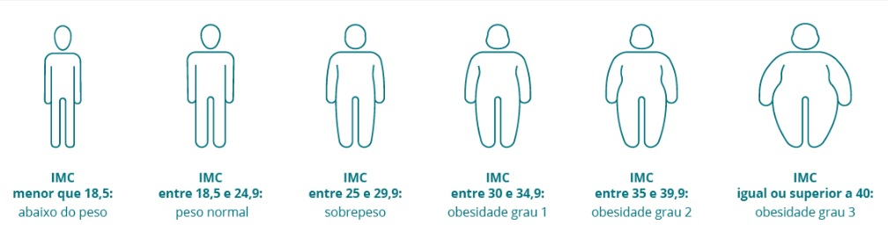

<p align="center">
  <a href="https://developer.mozilla.org/docs/Web/HTML" target="_blank" rel="noopener">
    
  </a>
  &nbsp;&nbsp;&nbsp;
  <a href="https://developer.mozilla.org/docs/Web/CSS" target="_blank" rel="noopener">
    
  </a>
  &nbsp;&nbsp;&nbsp;
  <a href="https://developer.mozilla.org/docs/Web/JavaScript" target="_blank" rel="noopener">
    
  </a>
</p>
<p align="center">
  <a></a>
  <a></a>
  <a></a>
  <a></a>
</p>

# <h1 align="center"> CALCULADORA IMC </h1>

## <b>O projeto</b> </br>
Calculadora de Índice de Massa Corporal (IMC) moderna e responsiva que calcula o índice corporal e classifica o resultado de acordo com os padrões da OMS. Interface intuitiva com experiência de usuário aprimorada.

## ✨ Funcionalidades

- ✅ Cálculo preciso do IMC
- ✅ Classificação automática conforme padrões da OMS
- ✅ Design totalmente responsivo
- ✅ Interface moderna com animações suaves
- ✅ Validação em tempo real
- ✅ Barra de progresso visual
- ✅ Tabela de referência integrada
- ✅ Navegação por teclado (Enter)

## 🚀 Tecnologias

- **HTML5** - Estrutura semântica
- **CSS3** - Design moderno com Flexbox/Grid
- **JavaScript** - Interatividade e cálculos

## 🎨 Design Features

- **Gradiente moderno** - Background atrativo
- **Glass morphism** - Efeito visual contemporâneo
- **Animações CSS** - Transições suaves
- **Responsividade** - Adaptável a todos os dispositivos
- **Feedback visual** - Validação interativa

## 📱 Layout Responsivo

| Desktop | Mobile |
|---------|--------|
|  |  |

<p align="center">
   <a href="https://developer.mozilla.org/docs/Web/HTML" target="_blank" rel="noopener">
      
   </a>
</p>

<p align="center">
   <a></a>
   <a></a>
   <a></a>
   <a></a>
</p>

## 🧮 Calculadora IMC

Uma calculadora moderna e responsiva para calcular o Índice de Massa Corporal (IMC). Projeto feito como exercício e exemplo de boas práticas com HTML, CSS e JavaScript (ES Modules), com foco em acessibilidade e UX.

## ✨ Tecnologias

- [HTML5](https://developer.mozilla.org/pt-BR/docs/Web/HTML)
- [CSS3](https://developer.mozilla.org/pt-BR/docs/Web/CSS)
- [JavaScript (ES6+)](https://developer.mozilla.org/pt-BR/docs/Web/JavaScript)

---

## 📋 Sobre o Projeto

- Interface em passos (welcome → dados → resultado) com barra de progresso.
- Validação de entradas (peso em kg, altura em cm) e mensagens de erro com suporte ARIA.
- Cálculo do IMC com classificação visual (Abaixo do peso, Peso normal, Sobrepeso, Obesidade I/II/III).
- Código modular: `js/imc.js` (funções puras) e `js/funcoes.js` (controle da UI).

---

## 📝 Funcionalidades

- Iniciar fluxo de cálculo em etapas
- Validação e mensagens de erro acessíveis
- Cálculo do IMC com precisão de uma casa decimal
- Classificação com cores correspondentes na tabela
- Recalcular ou finalizar (reset)

---

## 🗂️ Estrutura do Projeto

```
Calculadora-IMC/
├── index.html               # Página principal (app)
├── css/
│   └── style.css           # Estilos do projeto
├── js/
│   ├── funcoes.js          # Lógica da UI (ES Module)
│   └── imc.js              # Funções puras (calcular/classificar)
├── img/
│   ├── IMC.mp4
│   └── Tabela IMC.jpg      # Imagens e assets
├── README.md               # Documentação (este arquivo)
└── LICENSE                 # Licença
```

---

## ⚙️ Como executar

### Pré-requisitos

- Um navegador moderno (Chrome, Firefox, Edge, Safari)
- (Opcional) Live Server do VS Code ou qualquer servidor estático

### Executando localmente

1. Clone o repositório:

```
git clone https://github.com/joserenatofelix/Calculadora-IMC.git
```

2. Abra a pasta e abra `index.html` no navegador.

Opções:
- Abrir o arquivo diretamente no navegador.
- Usar Live Server (VS Code) ou um servidor estático:
---

## 🤝 Contribuindo

Contribuições são bem-vindas! Para contribuir:

1. Faça um fork do projeto
2. Crie uma branch para sua feature: `git checkout -b feature/minha-feature`
3. Faça commits claros: `git commit -m "feat: descrição da mudança"`
4. Envie para sua branch: `git push origin feature/minha-feature`
5. Abra um Pull Request

---

## � Licença

Este projeto está sob a licença MIT — veja o arquivo `LICENSE` para detalhes.

---

## 👨‍💻 Autor

**Renato Felix**

---

## 🎉 Agradecimentos

- Material didático e inspiração em layouts modernos

---

Se gostou, deixe uma estrela ⭐

Desenvolvido com ❤️ por Renato Felix




